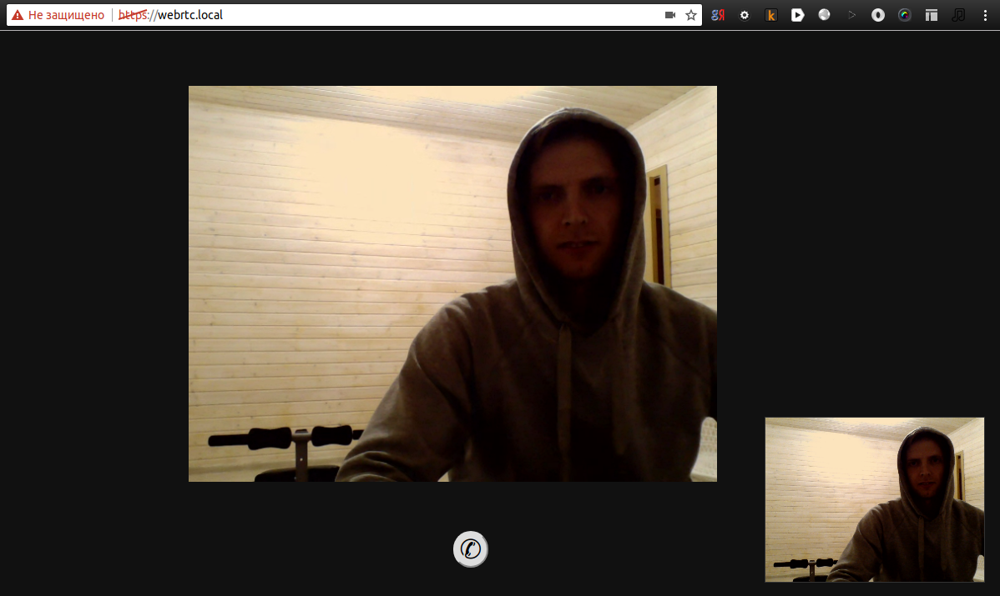

# Example of using WebRTC with socket.io (nodejs implementation)

## Installation

Generate keys:
```bash
openssl req -x509 -nodes -days 365 -newkey rsa:2048 -keyout ssl/ssl.key -out ssl/ssl.crt
```

Install dependencies:
```bash
npm install
npm run public
npm start
```

Open url [https://localhost:1234/socket.io/?EIO=3&transport=polling&t=Lw7LX0E](https://localhost:1234/socket.io/?EIO=3&transport=polling&t=Lw7LX0E) 
in browser and let use https connection.

Configure web server on `public` path of this project. Use https protocol.

Open url with index.html.

## Illustration

